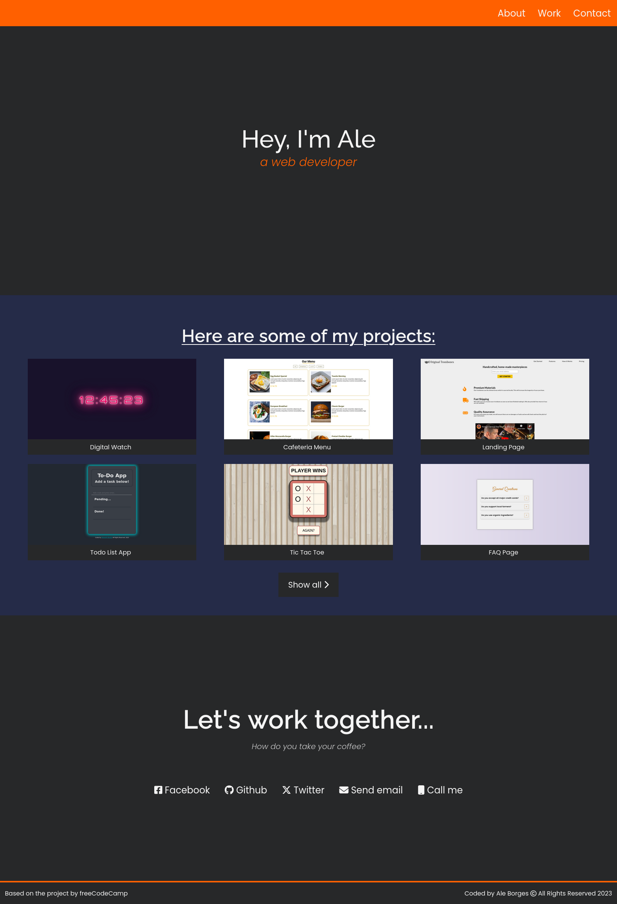

# Portfolio Project

This project is a responsive website that I created as part of my freeCodeCamp Responsive Web Design certification. The website is used to showcase my other projects and functions as a portfolio. The design is based on the freeCodeCamp example for this project. I used HTML5 and CSS3 to construct the website.

## Features

- Responsive design that adapts to different screen sizes
- Clean and modern design
- Easy to navigate
- Showcases my other projects

## Technologies Used

- HTML5
- CSS3

## How to Use

To view the website, you can clone the repository and open the index.html file. The website will be opened in your default web browser.

You can find the repository and live website below:

- [Repository](https://github.com/AlexdelCarmen/fcc-portfolio-project)
- [Live website](https://alexdelcarmen.github.io/fcc-portfolio-project/)

## Contributing

If you would like to contribute to this project, please feel free to fork the repository and open a pull request.

## Contact

If you have any questions or feedback, please feel free to contact me at alexbdelcarmen@gmail.com.

## License and attributions

This project is licensed under the MIT License. For more information check the [License](./LICENSE) file.

The design of this website is based on the [example provided by freeCodeCamp](https://personal-portfolio.freecodecamp.rocks/)

## Last Updated

This README file was last updated on August 18, 2023.
